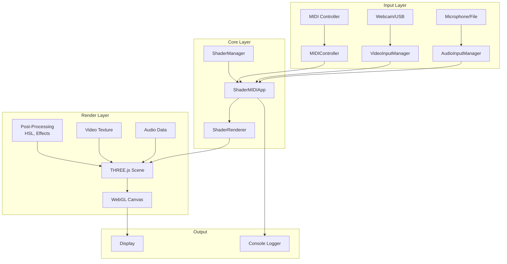
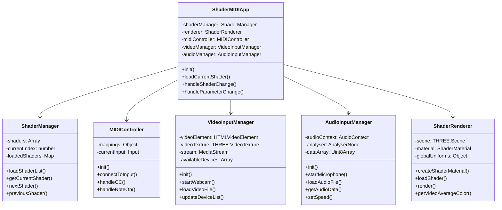
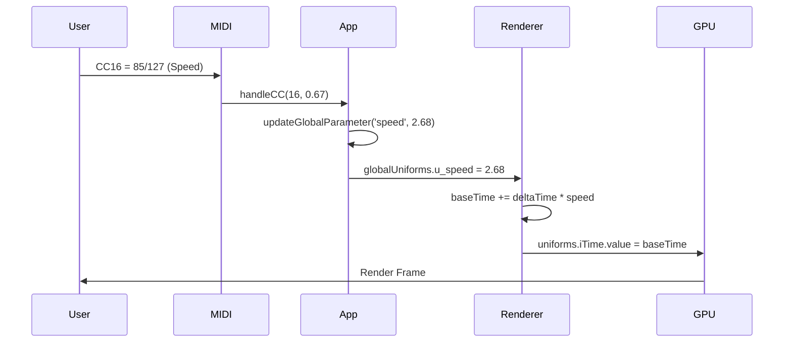
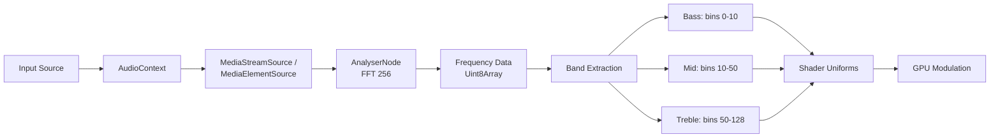

# SHADERS_PART_II 🎨🎹

Ein hochperformanter, interaktiver GLSL Shader Player mit vollständiger MIDI-Steuerung, Video-Mixing und Audio-Reaktivität.


**FOR SCALAR AND THE UNIVERSE** ✨

---

## 📑 Inhaltsverzeichnis

- [Features](#-features)
- [Architektur](#-architektur)
- [Installation](#-installation)
- [MIDI Mapping](#-midi-mapping-vollständige-übersicht)
- [Audio System](#-audio-system)
- [Video System](#-video-system)
- [Tastatursteuerung](#-tastatursteuerung)
- [Shader Format](#-shader-format)
- [Troubleshooting](#-troubleshooting)

---

## ✨ Features

### Core Features
- 🎨 **Automatisches Shader-Loading** - Alle `.glsl`/`.glsln`/`.gsls` Dateien werden dynamisch geladen
- 🎹 **Vollständige MIDI-Integration** - WebMIDI API mit Auto-Connect und Device-Hotswapping
- 🎥 **Video Input System** - Webcam, USB-Kameras (z.B. Logitech), Video-Dateien mit Drag & Drop
- 🎵 **Audio Reaktivität** - Microphone, Audio-Dateien mit FFT-Analyse (Bass/Mid/Treble)
- 🖼️ **Post-Processing Pipeline** - HSL-Manipulation, Contrast, Brightness, Zoom, Mirror
- 📊 **Extensive Logging** - Timestamped MIDI, Shader, System und Color-Sync Events

### Video Effects
| Effect | CC | Type | Description |
|--------|-----|------|-------------|
| Invert | CC41 | Toggle | Invertiert Videofarben |
| Blur | CC45 | Toggle | 5x5 Box Blur Filter |
| Pixelate | CC60 | Toggle | Pixelation Effekt |
| Rotation | CC18 | Continuous | 0-360° Video-Rotation |
| Kaleidoscope | CC19 | Continuous | 2-16 Segment Kaleidoskop |
| Chroma Key | CC20 | Continuous | Green Screen Removal |
| Edge Detection | CC21 | Continuous | Sobel Edge Detector |
| Color Shift | CC22 | Continuous | RGB Channel Offset |

### Audio Features
- ✅ Microphone Input mit WebAudio API
- ✅ External Soundcard Support (Volt 2, Focusrite, Scarlett, MOTU)
- ✅ Desktop Audio Capture (Chrome/Edge with flags)
- ✅ Audio File Upload (.mp3, .wav, etc.)
- ✅ FFT Analyzer (256 bins, smoothing 0.8)
- ✅ Frequency Bands: Bass (0-10), Mid (10-50), Treble (50-128)
- ✅ Real-time Waveform Visualization
- ✅ Audio → Parameter Modulation (Hue, Saturation, Brightness, Zoom)
- ✅ Audio-Reactive Distortion Effects (Horizontal, Vertical, Radial)
- ✅ Audio-Reactive Screen Split Modes (1/8, 1/4, Grid)

### Video Features
- ✅ Webcam/USB Camera Support (1280x720 ideal)
- ✅ Video File Upload mit Looping
- ✅ THREE.js VideoTexture Integration
- ✅ Device Enumeration mit Label-Detection (Logitech Priorität)
- ✅ Auto-reconnect bei Device-Change
- ✅ Color Sync Logging (RGB + HSL) alle 500ms

---

## 🏗️ Architektur

### System Overview (Mermaid UML)



### Class Diagram



### Data Flow



---

## 📦 Installation

```bash
# Clone Repository
git clone <repo-url>
cd SHADERS_II

# Install Dependencies
npm install

# Development Server
npm run dev

# Production Build
npm run build
```

**Dependencies:**
- `three` ^0.160.0 - 3D rendering engine
- `webmidi` ^3.1.11 - MIDI API wrapper
- `vite` ^5.0.12 - Build tool

**Browser Requirements:**
- Chrome/Edge 90+ (beste WebMIDI/WebAudio Support)
- Firefox 90+ (eingeschränkter MIDI Support)
- HTTPS oder localhost (für Webcam/Microphone Access)

---

## 🎹 MIDI Mapping (Vollständige Übersicht)

### Fader Controls (Continuous)

| CC | Parameter | Range | Default | Description |
|----|-----------|-------|---------|-------------|
| **CC0** | Vibrance | 0.0-1.0 | 0.0 | Boost low-saturation colors |
| **CC1** | Hue | 0-360° | 0° | Global hue rotation |
| **CC2** | Saturation | 0.0-1.0 | 1.0 | Color saturation multiplier |
| **CC3** | Grayscale | 0.0-1.0 | 0.0 | B&W mix amount |
| **CC4** | Contrast | 0.0-2.0 | 1.0 | Contrast adjustment |
| **CC5** | Brightness | 0.0-2.0 | 1.0 | Brightness multiplier |
| **CC6** | Zoom | 0.1-5.0 | 1.0 | Center-zoom factor |
| **CC7** | Video Mix | 0.0-1.0 | 0.0 | Video/Shader blend amount |
| **CC16** | Speed | 0.0-4.0 | 1.0 | Animation & audio playback speed |
| **CC17** | Audio Intensity | 0.0-1.0 | 0.0 | Master audio modulation depth |

### Video Effect Parameters

| CC | Parameter | Range | Description |
|----|-----------|-------|-------------|
| **CC18** | Video Rotation | 0-360° | Rotate video texture |
| **CC19** | Kaleidoscope | 2-16 segments | Mirrored radial segments |
| **CC20** | Chroma Key | 0.0-1.0 | Green screen threshold |
| **CC21** | Edge Detection | 0.0-1.0 | Sobel edge intensity |
| **CC22** | Color Shift | 0.0-1.0 | RGB channel offset |

### Audio Modulation (Audio → Parameters)

| CC | Target | Description |
|----|--------|-------------|
| **CC23** | Audio → Hue | Bass modulates hue (0-360°) |
| **CC24** | Audio → Saturation | Bass modulates saturation |
| **CC25** | Audio → Brightness | Bass modulates brightness |
| **CC26** | Audio → Zoom | Bass modulates zoom factor |

### Audio Distortion Effects (Audio-Reactive)

| CC | Parameter | Range | Description |
|----|-----------|-------|-------------|
| **CC50** | Horizontal Distortion | 0.0-1.0 | Horizontal wave distortion (bass-reactive) |
| **CC51** | Vertical Distortion | 0.0-1.0 | Vertical wave distortion (bass-reactive) |
| **CC52** | Radial Distortion | 0.0-1.0 | Circular/radial distortion (bass-reactive) |
| **CC53** | Screen Split | 0-3 modes | 0=Off, 1=1/8, 2=1/4, 3=Grid |

### Toggle Switches (Threshold > 64)

| CC | Parameter | Description |
|----|-----------|-------------|
| **CC41** | Video Invert | Toggle color inversion |
| **CC43** | Shader Previous | Previous shader in list |
| **CC44** | Shader Next | Next shader in list |
| **CC45** | Video Blur | Toggle 5x5 box blur |
| **CC48** | Mirror | Horizontal mirror effect |
| **CC60** | Video Pixelate | Toggle pixelation |

### Note Controls

| Event | Range | Description |
|-------|-------|-------------|
| **Note On** | 0-127 | Map note to shader index (proportional) |

---

## 🎵 Audio System

### Input Sources

```javascript
// 1. Microphone Input (Default)
AudioInputManager.startMicrophone()
// - getUserMedia API
// - Auto-request permissions
// - Real-time FFT analysis

// 2. External Soundcard (Volt 2, Focusrite, etc.)
AudioInputManager.startMicrophone(deviceId)
// - Device enumeration with labels
// - Highlighted with 🎚️ emoji in selector
// - Same pipeline as built-in mic
// - Supports: Volt, Focusrite, Scarlett, MOTU

// 3. Desktop Audio Capture
AudioInputManager.startDesktopAudio()
// - Chrome: getDisplayMedia with audio:true
// - Requires browser flags on some systems
// - No echo cancellation/noise suppression
// - Captures system audio output

// 4. Audio File Upload
AudioInputManager.loadAudioFile(file)
// - Supported: .mp3, .wav, .ogg, .m4a
// - Looping playback
// - MediaElementSource
// - Speed-synced with CC16
```

### Audio Processing Pipeline



### Audio Data Structure

```javascript
{
    frequency: Float32Array(128),  // Normalized 0-1
    waveform: Float32Array(128),   // Time-domain data
    intensity: 0.0-1.0,            // Average across all bands
    bass: 0.0-1.0,                 // Low frequencies (0-10)
    mid: 0.0-1.0,                  // Mid frequencies (10-50)
    treble: 0.0-1.0                // High frequencies (50-128)
}
```

### Playback Speed Sync

CC16 (Speed) controls both:
- `iTime` increment rate (shader animation)
- `audioElement.playbackRate` (audio file playback)

Range: 0.25x - 4.0x (clamped in AudioInputManager)

### Audio-Reactive Distortion Effects

All distortion effects react to bass frequencies in real-time:

#### Horizontal Wave Distortion (CC50)
```glsl
wave = sin(y * 10 + time) * audioBass * intensity * 50
fragCoord.x += wave
```
Creates horizontal waves that pulse with bass hits.

#### Vertical Wave Distortion (CC51)
```glsl
wave = sin(x * 10 + time) * audioBass * intensity * 50
fragCoord.y += wave
```
Creates vertical waves that pulse with bass hits.

#### Radial/Circular Distortion (CC52)
```glsl
angle = atan(y, x)
dist = length(coord)
wave = sin(dist * 20 - time * 3) * audioBass * intensity
fragCoord += vec2(cos(angle), sin(angle)) * wave * 30
```
Creates circular ripples emanating from center, synchronized with bass.

#### Screen Split Modes (CC53)

**Mode 0: Off** - No splitting

**Mode 1: 1/8 Split** - Vertical strips
- Screen divided into 8 vertical segments
- Each segment offset vertically based on audio
- Creates a "venetian blind" effect

**Mode 2: 1/4 Split** - Quadrants
- Screen divided into 4 quadrants
- Each quadrant rotates independently based on audio
- Creates kaleidoscopic rotation effect

**Mode 3: Grid** - 4x4 Grid
- Screen divided into 16 cells (4x4)
- Each cell zooms independently based on audio
- Creates a "mosaic zoom" effect

All effects combine with existing audio modulation (CC23-CC26) for layered reactivity.

---

## 🎥 Video System

### Supported Sources

1. **Integrated Webcam**
   - Auto-detected via `enumerateDevices()`
   - Default constraints: 1280x720

2. **USB Cameras** (e.g. Logitech)
   - Prioritized in device list with 📷 emoji
   - Exact deviceId constraints
   - Hot-swap support

3. **Video Files**
   - Drag & Drop onto canvas
   - Or click "Select Video File" button
   - Supported: .mp4, .webm, .ogv
   - Looping playback

### Video Effects Pipeline

```
Video Frame
    ↓
[Rotation] (CC18)
    ↓
[Kaleidoscope] (CC19)
    ↓
[Pixelate] (CC60)
    ↓
[Blur] (CC45)
    ↓
[Edge Detection] (CC21)
    ↓
[Color Shift] (CC22)
    ↓
[Invert] (CC41)
    ↓
[Chroma Key] (CC20)
    ↓
Mix with Shader (CC7)
```

### Color Sync Logging

Every 500ms when video is active:

```
[COLOR SYNC] Video: RGB(r, g, b) HSL(h°, s%, l%) | Shader: Hue=x° Sat=x Bright=x
```

Samples 16x16 downscaled frame for average color analysis.

---

## ⌨️ Tastatursteuerung

| Key | Function |
|-----|----------|
| `→` / `N` | Next shader |
| `←` / `P` | Previous shader |
| `H` | Toggle info overlay |
| `F` | Toggle fullscreen |

---

## 🎨 Shader Format

### Shadertoy Compatible

```glsl
void mainImage(out vec4 fragColor, in vec2 fragCoord) {
    vec2 uv = fragCoord / iResolution.xy;
    vec3 col = vec3(uv, 0.5 + 0.5 * sin(iTime));
    fragColor = vec4(col, 1.0);
}
```

### Available Uniforms

| Uniform | Type | Description |
|---------|------|-------------|
| `iTime` | float | Time since start (speed-adjusted) |
| `iResolution` | vec2 | Canvas resolution (width, height) |
| `iTimeDelta` | float | Time since last frame (speed-adjusted) |
| `iFrame` | int | Frame counter |
| `u_audioBass` | float | Bass frequency band (0-1) |
| `u_audioMid` | float | Mid frequency band (0-1) |
| `u_audioTreble` | float | Treble frequency band (0-1) |
| `u_videoTexture` | sampler2D | Video input (if active) |
| `u_hasVideo` | bool | Video texture available |

### Post-Processing (Automatic)

All shaders are wrapped with:
- HSL color space conversion
- Zoom transform
- Mirror effect
- Video texture mixing
- Audio-reactive modulation

---

## 🐛 Troubleshooting

### MIDI Issues

**No MIDI devices detected:**
- Check physical connection
- Verify browser MIDI permissions
- Use Chrome/Edge (best support)
- Check `chrome://device-log` for errors

**MIDI lag/jitter:**
- Close other audio apps (DAWs)
- Reduce MIDI message rate
- Check for USB bandwidth issues

### Audio Issues

**Microphone not working:**
- Allow microphone permissions in browser
- Check system audio settings
- Test with: `navigator.mediaDevices.getUserMedia({audio: true})`

**Audio file doesn't play:**
- Supported formats: MP3, WAV, OGG, M4A
- Check browser codec support
- Look for CORS errors in console

**No audio reactivity:**
- Increase CC17 (Audio Intensity)
- Check audio source is active (green visualizer)
- Verify analyser is receiving data (check logs)

### Video Issues

**Webcam not found:**
- Grant camera permissions
- Close other apps using camera (Zoom, Skype)
- Click "Refresh Cameras" button
- Check `navigator.mediaDevices.enumerateDevices()`

**USB camera not detected:**
- Wait 1-2 seconds after plugging in
- Click "Refresh Cameras" button
- Check device shows in system camera list
- Try different USB port

**Video file drops frames:**
- Use smaller resolution videos (<1080p)
- Use .mp4 with H.264 codec
- Check GPU acceleration is enabled

### Performance Issues

**Low FPS:**
- Open browser Task Manager (Shift+Esc)
- Reduce canvas resolution (Cmd/Ctrl + minus)
- Disable video effects (CC41, CC45, CC60)
- Use simpler shaders
- Check GPU isn't throttling (temperature)

**High CPU/GPU usage:**
- Normal for complex shaders
- Disable unnecessary video effects
- Reduce audio FFT size (modify code)
- Close other GPU apps

---

## 🔧 Advanced Configuration

### MIDI Mapping Customization

Edit `src/main.js` → `MIDIController.mappings`:

```javascript
this.mappings = {
    hue: { type: 'cc', value: 1 },  // Change to CC10
    // ... etc
}
```

### Audio Settings

Edit `src/AudioInputManager.js` → `setupAudioAnalyzer()`:

```javascript
this.analyser.fftSize = 256;              // FFT resolution
this.analyser.smoothingTimeConstant = 0.8; // Smoothing (0-1)
```

### Video Settings

Edit `src/VideoInputManager.js` → `startWebcam()`:

```javascript
constraints.video = {
    width: { ideal: 1920 },   // Increase resolution
    height: { ideal: 1080 },
    frameRate: { ideal: 60 }  // Higher framerate
}
```

---

## 📊 Project Statistics

```
Total Lines of Code: ~1500+
Languages: JavaScript (ES6+), GLSL (WebGL 2.0)
Architecture: Event-driven MVC with Manager Pattern
Rendering: THREE.js + WebGL
Performance: 60 FPS @ 1080p (typical shader)
Audio Latency: <10ms (WebAudio API)
Video Latency: <50ms (VideoTexture)
MIDI Latency: <5ms (WebMIDI API)
```

---

## 🚀 Roadmap

- [x] Audio-reactive distortion effects (horizontal/vertical/radial)
- [x] Screen split modes (1/8, 1/4, grid)
- [x] Desktop audio capture (via Chrome Tab Audio API)
- [x] External soundcard support (Volt 2, Focusrite, etc.)
- [ ] OSC (Open Sound Control) support
- [ ] Shader hot-reload without page refresh
- [ ] MIDI learn mode
- [ ] Preset save/load system
- [ ] Multi-shader layering
- [ ] DMX lighting control integration
- [ ] NDI output for streaming
- [ ] Recording/export functionality

---

## 📝 License

Free for personal and commercial use.

**FOR SCALAR AND THE UNIVERSE** ✨

---

## 🙏 Credits

Built with:
- [THREE.js](https://threejs.org/) - WebGL rendering
- [WebMidi.js](https://webmidijs.org/) - MIDI API wrapper
- [Vite](https://vitejs.dev/) - Build tool
